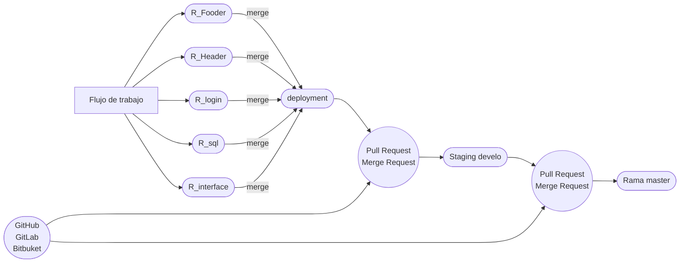

# Mis pasos a seguir

    git config -l
    git config --global user.name "dczinil@'star wars planet'"
    git config --global user.mail <dczinil@gmail.com>

#### Linux

    ssh-keygen -t ed25519 -C “dczinil@gmail.com”
    ssh-key -t rsa -b 4096 -C <dczinil@gmail.com>
    eval "$(ssh-agent -s)"
    install xclip
    xclip -selection clipboard < /.ssh/id_rsa.pub

### Windows

    ssh-keygen -t ed25519 -C “dczinil@gmail.com”
    ssh-keygen -t rsa -b 4096 -C <dczinil@gmail.com>
    clip < <url/ed25519.pub>

### Como iniciar bajar un repositorio de github

    git init
    git add <url>
    git commit -m "Comentarios"
    git remote add <url>
    git pull origin master

### Nuevo repositorio en la línea de comando

    echo "# aprendiendo_git" >> README.md
    git init
    git add README.md
    git commit -m "first commit"
    git branch -M <main o master>
    git remote add origin [https://github.com/dczinil/]<repositorio.git>
    git push -u origin <main o master>

### Inserte un repositorio existente desde la línea de comando

    git remote add origin [https://github.com/dczinil/]<repositorio.git>
    git branch -M <main o master>
    git push -u origin <main o master>

### Se realiza sta comando para iniciar "git" en la carpeta que se encuenta la terminal.

    git init

### config - Para tener una referencia de quién realiza los cambios agregamos.

Con este diferenciador se configuran los cambios de forma globla para todos los repositorios que se utilicen.

    git config --global

Con este diferenciador se configuran los cambios unicamente en ese repositorio.

    git config --local

Para revisar lo que tenemos configurado en git.

    git config -l

Para agregar el nombre a la configuracióon.

    git config --global users.name "<Nombre del usuario>"

Para agregar el correo a la configuración.

    git config --global user.email <elcorreo@mail.com>

### add - Es para agregar los archivos en el staging que signfica seguimiento. Agregando el ".", se le da seguimiento a todos los archivos en esa carpeta.

    git add <Url Archivos>

### rm - Para eliminar del staning y archivos.

    git rm <Url Archivo>

Borrar de la cache -->

    git rm <Url Archivo> --cache

### commit - es para enerar un punto de partida y saber que se modifico y quien, es la ase de git.

    git commit -m "Comentarios"

Agrega al commit todos los comentarios sin pasar por el "git add ...", solo aplica para los archivos que no son recien creados.

git commit -am "Comentarios"

### log - Ver el historico de los eventos de git se realiza. 

    git log

Revisas que cambios se han hecho a cada archivo.

    git log --stat

Para ver un los commit un poco más graficos.

    git log --all --graph 

Para ver los commit enun entorno aun más grafico y compacto.

    git log --all --graph --decorate --oneline

### Linux

    alias arbolitogit="git log --all --graph --decorate --oneline"

### show - Ver el historico de un archivo es con el comando

    git show <Nombre del archivo>

### diff - Ver las diferencias entre las versiones del archivo se usa; diff, utilizando los codigo de 'CommitHash', regresara la diferencia entre el primer commit y el utimo agregado

    git diff <CommitHash> <CommitHash>

```
El diff muestra las cambios que se han hecho en forma de historial a, b, c...
"@@...@@" nos indica cuantos bytes han cambiado entre versiones.
Nos muestra las líneas que han cambiado.
```
### reset - rSe utiliza para ir a un punto en la histori de los commit, Hay tres tipos de reset ´Hard´, ´Soft´ y ´Mixed´;

Permite restablecer al etado anterior pero mantiene el staging los commit ´eliminados´.</br>
    git reset <CommitHash> --soft

Permite restablecer al estado anterior, pero mantienen en working directory los commit ´eliminados´.</br>
    git reset <CommitHash> --mixed

Permite restableceral estado anterior. Todo vuelve como estaba, es el más peligroso por que borra todo.</br>
    git reset <CommitHash> --hard

### checlout -  Para regresar a un commit o trasladar se entre ramas.

    git checkout

Para regresar a la versión actual nuevamente es con checkout master 'nombre del archivo'.</br>
    git checkout ´CommitHash´

Para cambiar entre ramas.</br>
    git checkuot ´nombre de la rama´

Generar y posicionar se en la misma rama.</br>
    git checkout -b ´nombre de la rama´

### push - Manda las modificaciones a los repositorios remotos.

    git push -u origin <main o master>

Eliminar ramas de repositorios remotos.

    git push origin :<Nombre de la rama>

Enviar ramas a el repositorio remoto.

    git push origin <Nombre de la rama>

### fetch - Para traer los datos del repositorio remoto al local lasta recibir nueva instrucción git los mantiene en cache.

    git fetch

### merge - Une las ramas de trabajo.

Para unir ramas

    git merge

Cuando existe un conflicto. aparecen estos comentarios en el codigo:


https://www.jorgeacortes.com


VSCODE indica conque versión del conflicto te quieres quedar. En otros editores podría ser manual el realizar esta selección, por lo que lo podrías hacer manual.

- Guardar archivo
- Hay que volver hacer commit

Para abortar un merge o revertir hay que invocar.

    git merge --abort

### branche - Para generar una nueva rama

    git branch <nombre de la rama>

Para borrar una rama.</p>

    git branch -d <Nombre de la rama>

Forzar el barrar rama. Tal ves se necesite forzar en caso de que la rama tenga trabaos sin fusionar.

    git branch -D <Nombre de la rama>

Nos muestra el historial de todas las ramas a detalle

    git show-branch --all

### clone - trae el repositorio exstente desde remotos.

    git clone ´url´

Traes el repositorio a una carpeta espesificada. Si no existe la puede generar.</br>
    git clone ´url´ ´nombre de la carpeta´

### remote - Guardar el repositorio en la nube (GitHub, GitLab, etc.).

    git remote add origin "url"

Para verificar que la url se haya guardado correctamente.

    git remote
    git remote -v

### pull - A corta los comando de fetch y merge, con este unico comando bajas la información de los repositorios remotos al local.

    git pull origin ´master o main´ --allow-unrelated-histories

### tag - Este se utiliza para revisar las versiones de un proyecto. Se necesita un hash al que se le va aplicar este. #NOTE Los tag no son cambios. 

    git tag -a <Nombre del tag, lo comun 'v0.1'> -m "Comentarios sobre el tag" <Hash>

Para mostrar los tag que se tienen.

    git tag

Para saber a que commit o a que tag esta conectado cada tag.

    git show-ref --tags

Eviar los tag a la nube de repositorios se utliza.

    git push origin --tags

Eliminar tag #NOTE no se eliminan en la nube de git y esto es porque se pueden utilizar como release.

    git -d <Nombre del tag>

Eliminar tag de forma definitiva en la nube de git.

    git push origin :refs/tags/<Nombre del tag>

### .gitignore - Lo descrito en este archivo se ignora para no subir se a los repositorios locales o remotos

Se genera un archivo es impresindible que se llame <.gitignore> dentro del el va una lista de los archivos que se van a ignorar.</br>
    *.jpg
    *.log
    *.bak
    ´url_del_archivo´

Al finalizar hay que agregar lo al repositorio de forma normal a staging y posterior commit

    git add .gitignore
    git commit -m "Comentarios"

### Rebase - 'Es una mala practica', sobre escribe los repositorios por lo que si se llega a utilizar es importante que solo se use en el entorn local, la rama que se va unir no deberia de estar en el repositorio remoto solo en el localhost.

- Se debe de tener cuidado, dado que sobrescribe la historia del proyecto ocaciona varios conflictos cuando hay que hacer release.
- No quedan historial de los cambios originales.
- No se sabe el autor real de los commit.
- Si la rama principal avanzó varios commit puede generar varios conflictos que se tienen que corregir de forma manual.
- Rebase rimero a la rama que cambia (o que se va a eliminar), despues a la rama que va a qpermanecer.

### stash - Funsiona para poder ocultar momentanimente el trabajo y que git no los rastrie. Pero no estara guardado en ningun lugar.

Mando todos los archivos sin seguimiento a la memoria cache.</br>
    git stash

Para guardar los archivos que estan en staging.</br>
    git stash -u

Aun que stash te permite guardar los archivos sin mensaje la mejor practica es agregar un mensaje para tener contexto.</br>
    git stash save "mensaje"</br>
Dado que se pueden agregar parios archivos existe una forma de elistarlos.</br>
    git stash list
        stash@{0}: ...

Para visualizar las diferncias.</br>
    git stash show

Para ver las diferencias completas hay que agregar.</br>
    git stash show -p

Con el diferencial puede sacar todos los archivos en stash a la rama actual. Por defectostash lanzara el ultimo agregado.</br>
    git stash pop

Para lanzar un stash especifico hay que saber primero su identificador con 'list'.</br>
    git stash pop 'StashIdentificador'

Si tus cambios de stash ocacionan conflicto con tus ramas actuales, se puede generar un rama y agregar aplicar los cambios en esta.</br>
    git stash branch 'nombre de la rama' 'StashIdentificador'

Para aplicar los cambios en la rama que se encuentra.</br>
    git stash apply 

Si ya no requieres el stash puedes eliminar lo.</br>
    git stash drop 'StashIdentificador'

Para eliminar todos los stash.</br>
    git stash clear

### clean - Se puede considerar como un comando que completa; 'reset' y 'checkout'. Mientras que estos comandos trabaja con archivos en el repositorio 'clean' lo realiza con los que aun no son agregados a stagnig.


  

### cherry-pick - 


### amend - 


### grep -

## gitk - Muestra de forma grafica en una nueva ventana el historial completo de git. #NOTE se requiere instalar aparte e algunos sistemas operativos.

    gitk
## Markdown

La importanciía de tener un readme en la raíz de tu repositorio es para que puedan leer de que se trata y quienes pueden y como pueden contribuir. Hay paginas que te ayudan a editar lo.</br>
https://pandao.github.io/editor.md/en.html

## Entorno de trabajo

En un entorno de trabajo la rama master esta bloqueada para pasar a ella hay que hace un 'code review', si pasa todas las pruebas se realiza un 'pull request' al servidor de pruebas llamado 'Staging develop'. Despues de verificar que no hay errores se realizar otro 'pull request' (Esto solo es una caracteristica de los repositorios remotos cloud), a los servidores de producción.</br>


## DeVops Es quienrealiza los pull reques quien se encarga que los trabajos de los developers se vulevan más faciles.</br>
